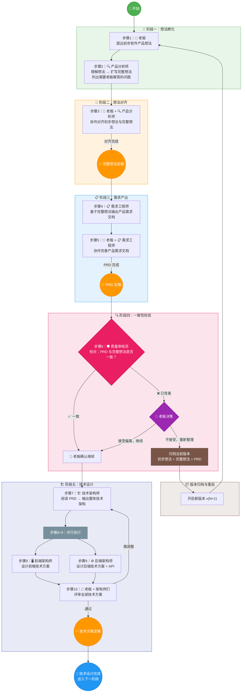

# 软件产品研发流程总览

> 本文档描述了从产品想法到技术设计的完整协作流程。  
> 流程中涉及 **老板（Boss）** 和多个 **AI Agent 角色**，每个 Agent 按职能命名。  
> 只有老板是人类，其余角色均为 AI Agent。

---

## Agent 角色一览

| 角色 | 代号 | 类型 | 职责 | 参与步骤 |
|------|------|------|------|----------|
| 👔 老板 | Boss | 🧑 人类 | 提出想法、决策、审批 | 1, 3, 5, 6, 10 |
| 🔍 产品分析师 | Product Analyst | 🤖 Agent | 理解并扩写想法，提出澄清问题 | 2, 3 |
| 📋 需求工程师 | Requirements Engineer | 🤖 Agent | 将完整想法转化为产品需求文档 | 4, 5 |
| 🛡️ 质量审核员 | Quality Reviewer | 🤖 Agent | 校对文档一致性 | 6 |
| 🏗️ 技术架构师 | Technical Architect | 🤖 Agent | 设计系统整体架构、技术选型 | 7, 10 |
| 🖥️ 前端架构师 | Frontend Architect | 🤖 Agent | 规划前端架构、页面路由、状态管理 | 8, 10 |
| ⚙️ 后端架构师 | Backend Architect | 🤖 Agent | 设计 API、数据模型、服务架构 | 9, 10 |

---

## 流程图



---

## 步骤详解

### 步骤 1｜👔 老板 → 提出初步想法

- **操作者**：老板
- **输入**：灵感、市场需求、痛点
- **输出**：[[01-初步想法/_模板-初步想法|初步想法文档]]
- **说明**：老板用简洁的语言描述产品核心概念，不必面面俱到

### 步骤 2｜🔍 产品分析师 → 扩写完整想法

- **操作者**：产品分析师（Agent）
- **输入**：初步想法文档
- **输出**：[[02-完整想法/_模板-完整想法|完整想法文档]]（草稿）
- **说明**：
  - 分析初步想法，补充细节和边界
  - 识别目标用户、核心场景、关键功能
  - 列出**需要老板解答的问题清单**

### 步骤 3｜👔 老板 + 🔍 产品分析师 → 对齐想法

- **操作者**：老板 & 产品分析师（协作）
- **输入**：初步想法 + 完整想法草稿
- **输出**：完整想法文档（定稿）
- **说明**：逐项确认扩写内容，回答 Agent 问题，确保方向一致

### 步骤 4｜📋 需求工程师 → 输出 PRD

- **操作者**：需求工程师（Agent）
- **输入**：完整想法（定稿）
- **输出**：[[03-产品需求文档/_模板-产品需求文档|产品需求文档]]（草稿）
- **说明**：将想法系统化为可执行的需求文档，包含功能列表、优先级、验收标准

### 步骤 5｜👔 老板 + 📋 需求工程师 → 完善 PRD

- **操作者**：老板 & 需求工程师（协作）
- **输入**：PRD 草稿
- **输出**：产品需求文档（定稿）
- **说明**：确认功能范围、优先级排序、验收标准

### 步骤 6｜🛡️ 质量审核员 → 一致性校验

- **操作者**：质量审核员（Agent）→ 老板决策
- **输入**：PRD（定稿）+ 完整想法（定稿）
- **输出**：[[04-校验记录/_模板-校验记录|校验记录]]
- **决策分支**：
  - ✅ **一致** → 进入阶段五：技术设计
  - ❌ **背离** → 老板决策：
    - **接受偏离** → 继续进入技术设计
    - **不接受** → 归档当前版本，重新开始

### 步骤 7｜🏗️ 技术架构师 → 整体技术架构设计

- **操作者**：技术架构师（Agent）
- **输入**：PRD（定稿）
- **输出**：[[05-技术架构/_模板-技术架构|技术架构文档]]（草稿）
- **说明**：
  - 确定技术选型（语言、框架、数据库、云服务等）
  - 设计系统整体架构（单体/微服务、服务划分）
  - 规划数据库 ER 设计
  - 定义接口通信方式和规范
  - 识别技术风险和约束

### 步骤 8｜🖥️ 前端架构师 → 前端技术方案（与步骤9并行）

- **操作者**：前端架构师（Agent）
- **输入**：PRD（定稿）+ 技术架构文档
- **输出**：[[05-技术架构/_模板-前端技术方案|前端技术方案]]
- **说明**：
  - 选择前端框架和工具链
  - 规划页面路由结构
  - 设计状态管理方案
  - 定义组件层级和复用策略
  - 制定前端编码规范

### 步骤 9｜⚙️ 后端架构师 → 后端技术方案（与步骤8并行）

- **操作者**：后端架构师（Agent）
- **输入**：PRD（定稿）+ 技术架构文档
- **输出**：[[05-技术架构/_模板-后端技术方案|后端技术方案]] + [[05-技术架构/_模板-API文档|API 文档]]
- **说明**：
  - 设计服务端架构和目录结构
  - 定义数据模型和表结构
  - 设计 RESTful / GraphQL API 接口
  - 规划认证、授权、错误处理等通用能力
  - 制定后端编码规范

### 步骤 10｜👔 老板 + 架构师们 → 技术方案评审

- **操作者**：老板（人类） & 技术架构师 + 前端架构师 + 后端架构师（Agent）
- **输入**：技术架构文档 + 前端技术方案 + 后端技术方案 + API 文档
- **输出**：全部技术文档（定稿）
- **说明**：
  - 老板确认技术方向是否符合产品要求和资源预算
  - 检查前后端方案与整体架构的一致性
  - 确认 API 设计覆盖 PRD 所有功能点
- **决策分支**：
  - ✅ **通过** → 技术设计完成，进入下一阶段
  - 🔄 **需调整** → 返回步骤7，修改后重新评审

---

## 版本管理规则

1. 每次重启流程时，当前版本的所有文档移至 `归档/vN-项目名/` 目录
2. 新版本从 `v(N+1)` 开始编号
3. 归档文档只读，不可修改

---

## 目录结构

```
项目根目录/
├── 00-流程与规范/          ← 流程定义和规范文档
├── 01-初步想法/            ← 老板的初步想法（步骤1）
├── 02-完整想法/            ← 产品分析师扩写的完整想法（步骤2-3）
├── 03-产品需求文档/        ← 需求工程师输出的PRD（步骤4-5）
├── 04-校验记录/            ← 质量审核员的校验结果（步骤6）
├── 05-技术架构/            ← 技术架构设计（步骤7-10）
│   ├── 整体架构/           ← 技术架构师输出（步骤7）
│   ├── 前端方案/           ← 前端架构师输出（步骤8）
│   └── 后端方案/           ← 后端架构师输出（步骤9），含 API 文档
└── 归档/                   ← 历史版本归档
    └── v1-项目名/
```

---

> [!tip] 使用提示
> 每个文档目录下都有以 `_模板-` 开头的模板文件，创建新文档时复制对应模板即可。
