# 软件产品研发流程总览

> 本文档描述了从产品想法到部署上线的完整协作流程。  
> 流程中涉及 **老板（Boss）** 和多个 **AI Agent 角色**，每个 Agent 按职能命名。  
> 只有老板是人类，其余角色均为 AI Agent。

---

## ⚡ 全局任务管理与上下文保护机制

> 为了解决大模型上下文冗长导致的记忆丢失问题，从**阶段五**及以后的重型技术设计和编码环节开始，**必须**跳出线性流程，强制使用**"全局任务清单"**进行任务拆解与分发。

- **任务卡片化**：所有具体工作（如前端方案设计）必须基于 [[06-全局任务管理/_模板-任务卡片]] 创建任务。
- **65% 规则**：每个任务执行前，负责人必须预判"背景 + 推理 + 输出物"是否会超过所用模型上下文的 65%。一旦超限，必须立刻拆分为母子任务。
- **独立对话执行**：每个任务/子任务必须在全新的独立对话（Session）中执行，完成后将输出链接登记至 [[06-全局任务管理/全局任务看板]]。

---

## Agent 角色一览

| 角色 | 代号 | 类型 | 职责 | 参与步骤 |
|------|------|------|------|----------|
| 🔍 产品分析师 | Product Analyst | 🤖 Agent | 扩写想法、提出澄清问题 | 2, 3, 16b |
| 📋 需求工程师 | Requirements Engineer | 🤖 Agent | 将想法转化为结构化 PRD | 4, 5 |
| 🛡️ 质量审核员 | Quality Reviewer | 🤖 Agent | 文档一致性校验、设计耦合校验 | 6, 9 |
| 🏗️ 技术架构师 | Technical Architect | 🤖 Agent | 系统架构设计、技术选型、任务拆解、编码执行 | 7, 8a, 9b, 11a, 12, 编码, 16b |
| 🖥️ 前端架构师 | Frontend Architect | 🤖 Agent | 前端架构、页面路由、状态管理、编码执行 | 7, 8b, 9b, 11b, 12, 编码, 16b |
| ⚙️ 后端架构师 | Backend Architect | 🤖 Agent | API 设计、数据模型、服务架构、编码执行 | 7, 8c, 9b, 11c, 12, 编码, 16b |
| 🎨 UI/UX 设计师 | UI/UX Designer | 🤖 Agent | 设计系统、线框图、交互原型、设计交付 | 7, 8d, 9b, 11d, 12, 编码, 16b |
| 🧪 测试工程师 | QA Engineer | 🤖 Agent | 测试用例、执行测试、缺陷跟踪、出具报告 | 13, 14, 15, 16, 16b |
| 🚀 运维经理 | DevOps Manager | 🤖 Agent | 评估部署需求、验收交付物、执行部署 | 17, 19 |
| 👔 老板 | Boss | 🧑 人类 | 提出想法、决策审批、验收、采购交付 | 1, 3, 5, 6, 9b, 10, 12, 16, 16b, 18 |

---

## 流程图

```mermaid
flowchart TD
    %% ========== 样式定义 ==========
    classDef phaseStyle fill:#f8f9fa,stroke:#dee2e6,stroke-width:1px,color:#333
    classDef startEnd fill:#1E88E5,stroke:#1565C0,color:#fff,stroke-width:2px
    classDef bossNode fill:#E3F2FD,stroke:#1E88E5,stroke-width:2px
    classDef agentNode fill:#E8F5E9,stroke:#43A047,stroke-width:2px
    classDef checkNode fill:#FFF3E0,stroke:#F4511E,stroke-width:2px
    classDef warnNode fill:#FCE4EC,stroke:#D81B60,stroke-width:2px

    %% ========== 阶段一~三：从想法到需求 ==========
    subgraph P1 ["阶段一~三 · 想法 → 需求 → 校验"]
        Start(("🚀 开始"))
        S1["1. 👔老板 提出初步想法"]
        S2["2. 🔍产品分析师 扩写完整想法"]
        S3["3. 👔老板 + 🔍产品分析师 对齐想法"]
        S4["4. 📋需求工程师 输出PRD草稿"]
        S5["5. 👔老板 + 📋需求工程师 完善PRD定稿"]
        S6{"6. 🛡️质量审核员 校验\nPRD 与完整想法是否一致?"}
    end

    Start --> S1 --> S2 --> S3 -->|"对齐完成"| S4 --> S5 -->|"PRD定稿"| S6

    %% 校验分支
    S6 -->|"✅ 一致"| S7
    S6 -->|"❌ 存在偏离"| BossDecide{"👔老板决策"}
    BossDecide -->|"接受偏离"| S7
    BossDecide -->|"不接受 → 归档重启"| Start

    %% ========== 阶段四~五：技术设计 → 任务拆解 ==========
    subgraph P2 ["阶段四~五 · 技术设计 → 审批 → 任务拆解"]
        S7["7. 全架构师+UI 初步沟通\n明确边界/框架/契约/规范"]
        S8["8. 四角色并行设计\n🏗️整体架构 · 🖥️前端方案\n⚙️后端方案 · 🎨UI设计"]
        S9{"9. 🛡️质量审核员 耦合校验\n4份设计文档能否满足PRD?"}
        S10{"10. 👔老板 最终审批"}
        S11["11. 四总监并行拆解任务卡片\n基于设计文档 → 独立任务卡"]
        S12{"12. 全员任务交叉评审\n依赖完整? 符合规范?"}
    end

    S7 --> S8 --> S9
    S9 -->|"✅ 校验通过"| S10
    S9 -->|"❌ 不通过"| S9b["9b. 全员诊断会议\n定位问题根因"]
    S9b -->|"问题在初步共识"| S7
    S9b -->|"问题在某板块"| S8fix["仅修正对应板块"] --> S9
    S10 -->|"✅ 审批通过"| S11
    S10 -->|"🔄 需调整方向"| S9b
    S11 --> S12
    S12 -->|"❌ 存在问题"| S11
    S12 -->|"✅ 评审通过"| Exec

    %% ========== 阶段七：编码执行 ==========
    subgraph P3 ["阶段七 · 编码执行"]
        Exec["各Agent按任务看板\n在独立对话中执行编码开发"]
    end

    Exec -. "📝 并行启动" .-> S13
    Exec -->|"✅ 编码完成"| S14a

    %% ========== 阶段八：测试验收 ==========
    subgraph P4 ["阶段八 · 测试验收"]
        S13["13. 🧪测试工程师\n编写测试用例（与编码并行）"]
        S14a{"14a. 🧪分模块测试\n逐模块执行用例"}
        S14b{"14b. 🧪联调测试\n全模块组合 → 逐项回溯PRD"}
        S15["15. 🧪测试工程师 出具测试报告"]
        S16{"16. 👔老板 验收审批"}
    end

    S13 -->|"用例就绪"| S14a
    S14a -->|"❌ 存在缺陷"| Fix1["对应总监确认\n分派修复任务"] --> S14a
    S14a -->|"✅ 模块测试通过"| S14b
    S14b -->|"❌ 与PRD不一致"| Fix2["按测试用例修改程序"] --> S14b
    S14b -->|"✅ 完全满足PRD"| S15 --> S16

    %% 验收分支
    S16 -->|"✅ 验收通过"| S17
    S16 -->|"❌ 不通过 ≤10次"| S13
    S16 -->|"🚨 不通过 >10次"| S16b

    S16b["16b. 全员验收诊断会议\n逐项定位根因 → 明确处置方案"] --> S14a

    %% ========== 阶段九：部署上线 ==========
    subgraph P5 ["阶段九 · 部署上线"]
        S17["17. 🚀运维经理 评估项目\n出具部署需求清单 + 交付物清单"]
        S18["18. 👔老板 完成采购并交付"]
        S19{"19. 🚀运维经理\n验收交付物 → 执行部署"}
    end

    S17 --> S18 --> S19
    S19 -->|"❌ 验收不通过"| S17
    S19 -->|"✅ 部署成功"| Finish(("🎉 项目上线"))

    %% ========== 阶段十：迭代复盘 ==========
    subgraph P6 ["阶段十 · 迭代复盘"]
        S20["20. 🚀运维经理+🔍产品分析师\n收集线上数据与用户反馈"]
        S21["21. 👔老板主导 全员复盘会议\n分析总结 → 输出复盘报告"]
    end

    Finish -->|"项目运行一段时间"| S20
    S20 --> S21
    S21 -. "携行动项开启新迭代" .-> Start

    %% ========== 着色 ==========
    class Start,Finish startEnd
    class S1,S3,S5,BossDecide,S10,S16,S18,S21 bossNode
    class S2,S4,S7,S8,S8fix,S9b,S11,Exec,S13,S14a,S14b,S15,Fix1,Fix2,S16b,S17,S19,S20 agentNode
    class S6,S9,S12 checkNode
```



---

## 步骤详解

> 下表为各阶段与步骤的快速索引：

| 阶段 | 步骤 | 内容 |
|------|------|------|
| 一、想法阶段 | 1–3 | 老板提出想法 → 产品分析师扩写 → 双方对齐 |
| 二、需求阶段 | 4–5 | 需求工程师起草PRD → 老板配合定稿 |
| 三、校验阶段 | 6 | 质量审核员校验PRD与想法一致性 → 老板决策 |
| 四、技术与设计阶段 | 7–10 | Kickoff → 并行设计 → 耦合校验 → 老板审批 |
| 五、任务拆解阶段 | 11–12 | 各总监并行拆解任务卡 → 交叉评审 |
| 六、编码执行阶段 | — | 各Agent按任务看板执行编码（与测试用例编写并行）|
| 七、测试验收阶段 | 13–16 | 分模块测试 → 联调+PRD回溯 → 测试报告 → 验收 |
| 八、部署上线阶段 | 17–19 | 运维评估 → 老板采购 → 部署上线 |

### 步骤 1｜👔 老板 → 提出初步想法

- **操作者**：老板
- **输入**：灵感、市场需求、痛点
- **输出**：[[01-初步想法/_模板-初步想法|初步想法文档]]
- **说明**：老板用简洁的语言描述产品核心概念，不必面面俱到

### 步骤 2｜🔍 产品分析师 → 扩写完整想法

- **操作者**：产品分析师（Agent）
- **输入**：初步想法文档
- **输出**：[[02-完整想法/_模板-完整想法|完整想法文档]]（草稿）
- **说明**：
  - 分析初步想法，补充细节和边界
  - 识别目标用户、核心场景、关键功能
  - 列出**需要老板解答的问题清单**

### 步骤 3｜👔 老板 + 🔍 产品分析师 → 对齐想法

- **操作者**：老板 & 产品分析师（协作）
- **输入**：初步想法 + 完整想法草稿
- **输出**：完整想法文档（定稿）
- **说明**：逐项确认扩写内容，回答 Agent 问题，确保方向一致

### 步骤 4｜📋 需求工程师 → 输出 PRD

- **操作者**：需求工程师（Agent）
- **输入**：完整想法（定稿）
- **输出**：[[03-产品需求文档/_模板-产品需求文档|产品需求文档]]（草稿）
- **说明**：将想法系统化为可执行的需求文档，包含功能列表、优先级、验收标准

### 步骤 5｜👔 老板 + 📋 需求工程师 → 完善 PRD

- **操作者**：老板 & 需求工程师（协作）
- **输入**：PRD 草稿
- **输出**：产品需求文档（定稿）
- **说明**：确认功能范围、优先级排序、验收标准

### 步骤 6｜🛡️ 质量审核员 → 一致性校验

- **操作者**：质量审核员（Agent）→ 老板决策
- **输入**：PRD（定稿）+ 完整想法（定稿）
- **输出**：[[04-校验记录/_模板-校验记录|校验记录]]
- **决策分支**：
  - ✅ **一致** → 进入阶段五：技术与设计方案
  - ❌ **背离** → 老板决策：
    - **接受偏离** → 继续进入技术与设计方案
    - **不接受** → 归档当前版本，重新开始

### 步骤 7｜全架构师 + 🎨 设计师 → 初步技术会议

- **操作者**：🏗️ 技术架构师 + 🖥️ 前端架构师 + ⚙️ 后端架构师 + 🎨 UI/UX 设计师（Agent）
- **输入**：PRD（定稿）
- **输出**：[[05-技术与设计方案/技术初步共识/_模板-技术初步共识文档|技术初步共识文档]]
- **说明**：
  - 前端、后端、技术架构师、UI/UX 设计师先进行一个初步会议
  - 基于 PRD，深入探讨并确定各板块的**边界**
  - 确定整体技术架构与具体实现的**约束条件**
  - 明确各端之间、设计与开发之间的**相互呼应关系**（如 API 契约、设计规范对齐、数据模型协同等）
  - 达成一致后，必须**落地到文档中**，作为后续并行分工的依据

### 步骤 8｜各角色并行分工

> 以下四个角色基于步骤7的共识，**同时**开展各自板块的工作。

#### 8a｜🏗️ 技术架构师 → 整体技术架构

- **输入**：PRD + 技术初步共识文档
- **输出**：[[05-技术与设计方案/整体架构/_模板-技术架构|技术架构文档]]
- **内容**：技术选型、系统架构图、服务划分、数据库 ER 设计、技术风险

#### 8b｜🖥️ 前端架构师 → 前端技术方案

- **输入**：PRD + 技术初步共识文档
- **输出**：[[05-技术与设计方案/前端方案/_模板-前端技术方案|前端技术方案]]
- **内容**：前端框架选型、页面路由、状态管理、组件设计、编码规范

#### 8c｜⚙️ 后端架构师 → 后端技术方案 + API 文档

- **输入**：PRD + 技术初步共识文档
- **输出**：[[05-技术与设计方案/后端方案/_模板-后端技术方案|后端技术方案]] + [[05-技术与设计方案/后端方案/_模板-API文档|API 文档]]
- **内容**：服务端架构、数据模型、API 接口设计、认证授权、编码规范

#### 8d｜🎨 UI/UX 设计师 → 设计规范 + 交互原型

- **输入**：PRD + 技术初步共识文档
- **输出**：[[05-技术与设计方案/UI设计/_模板-UI设计规范|UI 设计规范]] + [[05-技术与设计方案/UI设计/_模板-交互原型|交互原型]]
- **内容**：设计系统（颜色/字体/间距）、页面线框图、交互流程、组件样式

### 步骤 9｜🛡️ 质量审核员 → 设计方案耦合校验

- **操作者**：质量审核员（Agent）
- **输入**：步骤8中四份设计文档 + PRD（定稿）+ 技术初步共识文档
- **输出**：[[04-校验记录/_模板-设计耦合校验|设计耦合校验报告]]
- **校验要点**：
  - 四份设计文档之间是否**相互耦合一致**（前端组件 vs UI设计规范、前端API调用 vs 后端接口文档、数据模型 vs 整体架构ER图）
  - 基于这四份文档去研发系统，**能否做出满足 PRD 所有功能点的产品**
  - 各文档是否遵循了技术初步共识中约定的边界与约束
- **决策分支**：
  - ✅ **校验通过** → 进入步骤10（老板最终审批）
  - ❌ **校验不通过** → 进入步骤 9b（全员诊断会议）

### 步骤 9b｜全员诊断会议 → 定位问题根因

- **操作者**：🏗️ 技术架构师 + 🖥️ 前端架构师 + ⚙️ 后端架构师 + 🎨 UI/UX 设计师 + 🔍 产品分析师 + 👔 老板
- **输入**：设计耦合校验报告 + 四份设计文档 + 技术初步共识文档
- **输出**：诊断结论与修正指令
- **流程**：
  1. 全员审阅校验报告中标注的不通过项
  2. **根因分析**：判断问题出在哪里
     - **情况A：问题在「技术初步共识」** → 说明边界划错了或约束条件有遗漏。修改技术初步共识文档，然后**所有板块基于新共识重新设计**（返回步骤7）
     - **情况B：问题在某份具体的设计文档** → 明确指出是「整体架构 / 前端方案 / 后端方案 / UI设计」中的哪一份或几份有问题。**仅要求对应板块修正**，修正后重新进行步骤9耦合校验

### 步骤 10｜👔 老板 → 最终审批

- **操作者**：老板（人类）
- **输入**：通过耦合校验的四份设计文档 + 校验报告
- **输出**：审批结论
- **说明**：老板确认整体方向是否符合预期、是否满足资源预算
- **决策分支**：
  - ✅ **审批通过** → 所有设计文档定稿，进入阶段六：任务拆解
  - 🔄 **需调整方向** → 进入步骤9b诊断会议，由老板提出调整方向后修正

---

## 阶段六：任务拆解

> 设计文档定稿后，各板块总监基于自己的设计文档，将工作拆解为独立的、可由 Agent 在单次对话中执行完成的任务卡片。所有任务必须符合 [[06-全局任务管理/_模板-任务卡片]] 的规范。

### 步骤 11｜各总监并行拆解 → 任务卡片

- **操作者**：🏗️ 技术架构师 + 🖥️ 前端架构师 + ⚙️ 后端架构师 + 🎨 UI/UX 设计师（各自独立）
- **输入**：各自板块的定稿设计文档 + 技术初步共识文档
- **输出**：一组任务卡片（登记至 [[06-全局任务管理/全局任务看板]]）
- **拆解规则**：
  1. 每个任务必须使用 [[06-全局任务管理/_模板-任务卡片]] 创建
  2. 每个任务必须包含：**背景信息、规范约束、执行标准、验收标准**
  3. 每个任务必须进行**上下文容量预判**（65% 法则）：
     - 任务本身 + 任务全程交互 + 任务输出物，控制在所使用模型的一个对话上下文上限 65% 以下
  4. 如果预判超过 65%，必须拆分为**母任务 + 子任务**
  5. 母任务和子任务都各自需要满足上述所有条件
  6. 每个任务执行时，启用一个独立的对话，保证足够的上下文空间
  7. 如果某任务发现依赖其他板块，必须触发**跨界依赖协同**流程（参见任务卡片模板第6项）

#### 11a｜🏗️ 技术架构师 → 拆解整体架构任务

- **输入**：技术架构文档（定稿）
- **拆解方向**：基础设施搭建、数据库初始化、通用服务/中间件配置、CI/CD 流水线等

#### 11b｜🖥️ 前端架构师 → 拆解前端开发任务

- **输入**：前端技术方案（定稿）+ UI 设计规范
- **拆解方向**：项目脚手架搭建、路由配置、状态管理搭建、各页面/组件开发、联调任务等

#### 11c｜⚙️ 后端架构师 → 拆解后端开发任务

- **输入**：后端技术方案（定稿）+ API 文档
- **拆解方向**：项目框架搭建、数据模型实现、各 API 接口开发、认证授权模块、联调任务等

#### 11d｜🎨 UI/UX 设计师 → 拆解设计交付任务

- **输入**：UI 设计规范 + 交互原型（定稿）
- **拆解方向**：各页面高保真设计稿、图标/插图资源输出、设计走查任务等

### 步骤 12｜全员 → 任务交叉评审

- **操作者**：全体架构师/设计师 + 👔 老板
- **输入**：所有板块拆解出的任务卡片 + 全局任务看板
- **输出**：评审通过的任务清单
- **评审要点**：
  - 各板块的任务之间是否存在**未声明的依赖**（例如前端某页面需要后端接口，但后端没有对应的任务）
  - 每个任务卡片是否满足规范（背景信息、约束、验收标准、65% 容量预判）
  - 任务的**执行顺序**是否合理（是否有阻塞链路）
  - 跨界协同任务是否已经完成双边会签
- **决策分支**：
  - ✅ **评审通过** → 全部任务登记至看板，进入执行阶段
  - 🔄 **存在问题** → 标注问题，对应总监修正任务拆解，重新评审

---

## 阶段七：编码执行

> 任务评审通过后，各板块 Agent 按照全局任务看板中的任务卡片，在独立对话中执行编码开发。测试用例编写与编码开发**并行启动**。

### 编码执行流程

- **操作者**：🏗️ 技术架构师 + 🖥️ 前端架构师 + ⚙️ 后端架构师 + 🎨 UI/UX 设计师（各自独立执行）
- **输入**：全局任务看板上的任务卡片（已通过评审）+ 各板块定稿设计文档
- **输出**：已完成的代码/设计资产（按任务卡片验收标准交付）
- **执行规则**：
  1. 每个任务卡片必须在**独立的对话（Session）**中执行
  2. 执行前必须确认任务卡片中的背景信息、约束条件和验收标准
  3. 完成后将输出物链接登记至 [[06-全局任务管理/全局任务看板]]，更新任务状态为「已完成」
  4. 如果执行中发现**跨界依赖**，必须触发任务卡片中的跨界协同流程
  5. 所有任务执行完毕后，进入测试验收阶段
- **并行事项**：测试工程师在编码开发期间同步编写测试用例（步骤13），不需等待编码完成

---

## 阶段八：测试验收

> 任务评审通过、编码开发启动后，测试工程师基于 PRD 和设计文档编写测试用例。开发完成后执行测试、跟踪缺陷，直至产品质量满足验收标准。

### 步骤 13｜🧪 测试工程师 → 编写测试用例

- **操作者**：测试工程师（Agent）
- **输入**：PRD（定稿）+ 四份设计文档（定稿）
- **输出**：[[07-测试验收/_模板-测试用例|测试用例文档]]
- **说明**：
  - 测试用例编写与任务执行（编码）**并行启动**，不需要等待代码完成
  - 按 PRD 功能模块分组，逐一编写测试用例
  - P0/P1 功能点必须 100% 覆盖，P2 覆盖核心路径
  - 必须包含边界条件和异常场景的测试
  - 完成后必须进行 PRD 功能点覆盖度自检
  - 如果用例数量可能导致上下文超过 65%，按模块拆分为多个文件

### 步骤 14｜🧪 测试工程师 → 执行测试 & 缺陷跟踪

- **操作者**：测试工程师（Agent）+ 对应板块总监（协同）
- **输入**：测试用例文档 + 开发完成的产品
- **输出**：测试用例（标注实际结果）+ [[07-测试验收/_模板-缺陷报告|缺陷报告]]（如有）
- **流程分为两个阶段**：

#### 14a｜分模块测试 & 缺陷跟踪

- 按模块逐一执行测试用例，记录实际结果
- 发现缺陷时创建缺陷报告，标注严重程度
- **缺陷修复流程**：
  1. 测试工程师创建缺陷报告（状态：新建）
  2. 对应板块总监确认缺陷有效（状态：已确认）
  3. 总监创建修复任务卡片，分派修复（状态：修复中）
  4. 修复完成后，测试工程师回归测试（状态：待回归→已关闭/重新打开）
- 反复循环直至各模块测试用例全部通过

#### 14b｜联调测试 & PRD 需求回溯校验

> ⚠️ **这是测试阶段的核心环节**：所有功能模块组合在一起之后，必须将整个产品作为一个整体，回溯对照完整需求文档（PRD），逐项验证是否满足初始需求。

- 将所有已通过模块测试的功能**组合为完整产品**，进行端到端联调测试
- **逐项回溯 PRD**：将联调后的产品行为，与 PRD 中的每一个功能点、每一条验收标准进行一一比对
- 如果发现产品行为与 PRD 需求**不一致**：
  1. 创建缺陷报告，明确标注「需求偏离」类型
  2. 按照测试用例中定义的预期结果（即 PRD 的要求）**修改程序**
  3. 修改完成后重新进行联调测试和 PRD 回溯
- **反复循环，直到产品完全满足完整需求文档（PRD）中的所有功能点**
- 联调测试还需关注：
  - 模块间数据流转是否正确
  - 跨模块交互场景是否符合 PRD 描述的用户旅程
  - 端到端业务流程是否完整可走通

### 步骤 15｜🧪 测试工程师 → 出具测试报告

- **操作者**：测试工程师（Agent）
- **输入**：执行完毕的测试用例 + 所有缺陷报告
- **输出**：[[07-测试验收/_模板-测试报告|测试报告]]
- **说明**：
  - 汇总测试执行情况：通过率、缺陷分布、未关闭缺陷
  - 给出明确测试结论：通过 / 有条件通过 / 不通过
  - **通过条件**：所有 P0/P1 用例通过，无致命/严重级未关闭缺陷
  - 评估残余风险，给出是否可以进入验收的建议

### 步骤 16｜👔 老板 → 验收审批

- **操作者**：老板（人类）+ 🧪 测试工程师（协助）
- **输入**：测试报告 + PRD（定稿）
- **输出**：[[07-测试验收/_模板-验收报告|验收报告]]
- **说明**：
  - 老板基于测试报告和 PRD 逐项验收产品功能
  - 检查非功能性需求（性能、安全、兼容性等）
  - 记录遗留问题及其处置方式
  - ⚠️ **每次验收不通过时，必须累计计数**
- **决策分支**：
  - ✅ **验收通过** → 进入下一阶段（部署与上线）
  - 🟡 **有条件通过** → 明确后续条件，完成后重新验收对应部分
  - ❌ **验收不通过（≤10次）** → 返回步骤13补充测试用例，继续修复和测试
  - 🚨 **验收不通过（累计超过10次）** → 触发步骤 16b 验收诊断会议

### 步骤 16b｜全员验收诊断会议 → 定位问题根因并明确处置方案

> ⚠️ 当验收不通过累计超过 10 次时强制触发。说明产品存在系统性问题，单纯的缺陷修复循环已无法解决，需要全员介入分析根因。

- **操作者**：👔 老板 + 🔍 产品分析师 + 🏗️ 技术架构师 + 🖥️ 前端架构师 + ⚙️ 后端架构师 + 🎨 UI/UX 设计师 + 🧪 测试工程师
- **输入**：历次验收报告（含所有不通过项）+ 测试报告 + PRD（定稿）+ 四份设计文档
- **输出**：验收诊断结论与处置方案
- **流程**：
  1. 🧪 测试工程师汇报：汇总历次验收中**反复不通过的具体功能点**
  2. 全员审阅：逐项分析每个不通过项的根因
  3. **根因分类与处置决策**：
     - **情况A：实现偏差** — 代码实现与设计文档/PRD不符 → 明确由哪个板块总监负责修正，创建修复任务
     - **情况B：设计方案缺陷** — 设计文档本身存在遗漏或错误 → 修正对应设计文档，再基于新设计重新实现
     - **情况C：PRD 需求不合理或有歧义** — 需求本身存在问题 → 老板决策是否调整需求，更新 PRD 后同步更新测试用例
     - **情况D：技术限制** — 当前技术方案无法实现该需求 → 老板决策是否接受替代方案、降级实现或延后至下一版本
  4. 对每个不通过项**逐一给出明确处置结论**，落地到文档中
  5. 各板块按处置方案执行修正，完成后返回步骤14a重新测试
- **会议纪律**：
  - 每个不通过项必须有明确的**责任人**和**完成时限**
  - 处置方案必须落地到任务卡片，登记至全局任务看板
  - 如果老板决策调整 PRD，必须同步更新测试用例

---

## 阶段九：部署上线

> 产品验收通过后，运维经理接管负责前后端部署上线。运维经理评估项目基础设施需求，老板完成采购和交付后，运维经理验收并执行部署。

### 步骤 17｜🚀 运维经理 → 评估项目并出具部署需求清单

- **操作者**：运维经理（Agent）
- **输入**：技术架构文档（定稿）+ 后端技术方案（定稿）+ 前端技术方案（定稿）+ 验收报告
- **输出**：[[08-部署上线/_模板-部署需求清单|部署需求清单]]
- **说明**：
  - 基于技术架构和设计文档，全面评估部署所需的基础设施
  - **云服务采购需求**：服务器、数据库、CDN、域名、SSL、存储等
  - **费用预估**：给出月度和年度费用预估，让老板清晰了解成本
  - **交付物清单**：明确老板完成采购后需要交付什么给运维经理（账号凭证、域名权限、证书文件、配置信息等）
  - 如果是部署验收不通过后重新出具，需明确标注**本次新增或变更的需求项**

### 步骤 18｜👔 老板 → 完成采购并交付

- **操作者**：老板（人类）
- **输入**：部署需求清单
- **输出**：采购完成的资源 + 交付物
- **说明**：
  - 按照部署需求清单，完成云服务和基础设施采购
  - 将所有交付物（账号凭证、域名权限、SSL证书、API Key 等）移交给运维经理
  - 在部署需求清单的「老板操作区」确认采购和交付状态

### 步骤 19｜🚀 运维经理 → 验收交付物并执行部署

- **操作者**：运维经理（Agent）
- **输入**：老板交付的资源和凭证 + 源代码 + 技术架构文档
- **输出**：[[08-部署上线/_模板-部署验收报告|部署验收报告]]
- **说明**：
  - **验收采购资源**：逐项检查老板采购的云服务是否满足需求规格
  - **验收交付物**：逐项检查凭证、权限、证书等是否完整可用
  - **执行部署**：基础设施初始化 → 数据库初始化 → 后端服务部署 → 前端应用部署 → 域名/SSL配置 → 冒烟测试
  - 记录部署过程中的关键操作和结果
- **决策分支**：
  - ✅ **部署成功** → 🎉 项目上线完成
  - ❌ **验收不通过** → 运维经理重新出具部署需求清单（返回步骤17），列出需要老板补充采购或整改的事项

---

## 阶段十：迭代复盘

> 项目上线并运行一段时间后，收集真实数据与反馈，全员复盘总结，闭环研发流程并为新一轮迭代做准备。

### 步骤 20｜🚀 运维经理+🔍 产品分析师 → 收集运行数据与用户反馈

- **操作者**：运维经理（Agent）、产品分析师（Agent）
- **输入**：线上服务日志、监控平台数据、用户反馈渠道信息
- **输出**：基础数据与反馈整理
- **说明**：
  - 运维经理负责汇总服务的可用性、性能指标、故障日志等客观工程数据
  - 产品分析师负责汇总应用商店评论、客服渠道、社交媒体上的真实用户评价与抱怨
  - 形成初步的事实数据盘点，为复盘会议做准备

### 步骤 21｜👔 老板主导 → 全员复盘会议与开启新迭代

- **操作者**：全员（老板主持，各 Agent 参与）
- **输入**：步骤20产出的事实数据 + PRD 设定的业务目标 + 各研发环节的记忆
- **输出**：[[09-迭代复盘/_模板-版本复盘报告|版本复盘报告]]
- **说明**：
  - 老板主持会议，评估线上业务数据是否达到初期的设想预期
  - 全员反思本轮研发过程中的「最佳实践（What Went Well）」与「存在问题（What Could Be Improved）」
  - 将讨论结果整理成《版本复盘报告》，并提炼出**具体的下一步行动项（Action Items）**
  - **闭环：** 带着这些行动项，产品重新回到「步骤1：提出初步想法」，开启 V(N+1) 的新迭代循环

---

## 版本管理规则

1. 每次重启流程时，当前版本的所有文档移至 `归档/vN-项目名/` 目录
2. 新版本从 `v(N+1)` 开始编号
3. 归档文档只读，不可修改
4. 当步骤16b验收诊断会议决定调整 PRD 时，必须同步更新测试用例和受影响的设计文档，并在文档头部标注版本号变更
5. 每份文档的 frontmatter 中的 `版本` 字段必须与当前迭代保持一致

---

## 目录结构

```
项目根目录/
├── 00-流程与规范/              ← 流程定义和规范文档
├── 01-初步想法/                ← 老板的初步想法（步骤1）
├── 02-完整想法/                ← 产品分析师扩写的完整想法（步骤2-3）
├── 03-产品需求文档/            ← 需求工程师输出的PRD（步骤4-5）
├── 04-校验记录/                ← 质量审核员的校验结果（步骤6、9）
├── 05-技术与设计方案/          ← 技术与设计方案（步骤7-9）
│   ├── 技术初步共识/           ← 步骤7 Kickoff 产出
│   ├── 整体架构/               ← 🏗️ 技术架构师（步骤8a）
│   ├── 前端方案/               ← 🖥️ 前端架构师（步骤8b）
│   ├── 后端方案/               ← ⚙️ 后端架构师（步骤8c），含 API 文档
│   └── UI设计/                 ← 🎨 UI/UX 设计师（步骤8d）
├── 06-全局任务管理/            ← 任务卡片与看板（步骤11-12）
├── 07-测试验收/                ← 🧪 测试工程师（步骤13-16）
│   ├── _模板-测试用例.md       ← 步骤13：测试用例
│   ├── _模板-缺陷报告.md       ← 步骤14：缺陷跟踪
│   ├── _模板-测试报告.md       ← 步骤15：测试报告
│   └── _模板-验收报告.md       ← 步骤16：验收报告
├── 08-部署上线/                ← 🚀 运维经理（步骤17-19）
│   ├── _模板-部署需求清单.md   ← 步骤17-18：采购需求+交付物清单
│   └── _模板-部署验收报告.md   ← 步骤19：部署验收
├── 09-迭代复盘/                ← 全员复盘（步骤20-21）
│   └── _模板-版本复盘报告.md   ← 步骤21：版本复盘报告
└── 归档/                       ← 历史版本归档
    └── v1-项目名/
```

---

> [!tip] 使用提示
> 每个文档目录下都有以 `_模板-` 开头的模板文件，创建新文档时复制对应模板即可。
