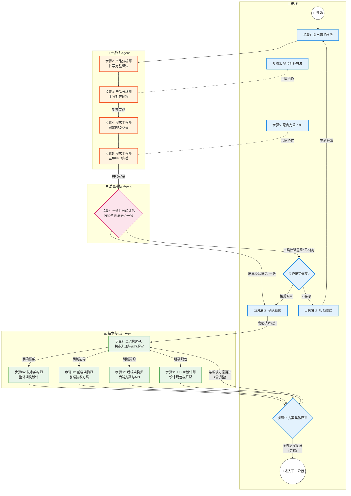

# 软件产品研发流程总览

> 本文档描述了从产品想法到技术设计的完整协作流程。  
> 流程中涉及 **老板（Boss）** 和多个 **AI Agent 角色**，每个 Agent 按职能命名。  
> 只有老板是人类，其余角色均为 AI Agent。

---

## ⚡ 全局任务管理与上下文保护机制

> 为了解决大模型上下文冗长导致的记忆丢失问题，从**阶段五**及以后的重型技术设计和编码环节开始，**必须**跳出线性流程，强制使用**"全局任务清单"**进行任务拆解与分发。

- **任务卡片化**：所有具体工作（如前端方案设计）必须基于 [[06-全局任务管理/_模板-任务卡片]] 创建任务。
- **65% 规则**：每个任务执行前，负责人必须预判"背景 + 推理 + 输出物"是否会超过所用模型上下文的 65%。一旦超限，必须立刻拆分为母子任务。
- **独立对话执行**：每个任务/子任务必须在全新的独立对话（Session）中执行，完成后将输出链接登记至 [[06-全局任务管理/全局任务看板]]。

---

## Agent 角色一览

| 角色 | 代号 | 类型 | 职责 | 参与步骤 |
|------|------|------|------|----------|
| 👔 老板 | Boss | 🧑 人类 | 提出想法、决策、审批 | 1, 3, 5, 6, 7, 9 |
| 🔍 产品分析师 | Product Analyst | 🤖 Agent | 理解并扩写想法，提出澄清问题 | 2, 3 |
| 📋 需求工程师 | Requirements Engineer | 🤖 Agent | 将完整想法转化为产品需求文档 | 4, 5 |
| 🛡️ 质量审核员 | Quality Reviewer | 🤖 Agent | 校对文档一致性 | 6 |
| 🏗️ 技术架构师 | Technical Architect | 🤖 Agent | 设计系统整体架构、技术选型 | 7, 8, 9 |
| 🖥️ 前端架构师 | Frontend Architect | 🤖 Agent | 规划前端架构、页面路由、状态管理 | 7, 8, 9 |
| ⚙️ 后端架构师 | Backend Architect | 🤖 Agent | 设计 API、数据模型、服务架构 | 7, 8, 9 |
| 🎨 UI/UX 设计师 | UI/UX Designer | 🤖 Agent | 设计线框图、交互原型、设计规范 | 7, 8, 9 |

---

## 流程图



---

## 步骤详解

### 步骤 1｜👔 老板 → 提出初步想法

- **操作者**：老板
- **输入**：灵感、市场需求、痛点
- **输出**：[[01-初步想法/_模板-初步想法|初步想法文档]]
- **说明**：老板用简洁的语言描述产品核心概念，不必面面俱到

### 步骤 2｜🔍 产品分析师 → 扩写完整想法

- **操作者**：产品分析师（Agent）
- **输入**：初步想法文档
- **输出**：[[02-完整想法/_模板-完整想法|完整想法文档]]（草稿）
- **说明**：
  - 分析初步想法，补充细节和边界
  - 识别目标用户、核心场景、关键功能
  - 列出**需要老板解答的问题清单**

### 步骤 3｜👔 老板 + 🔍 产品分析师 → 对齐想法

- **操作者**：老板 & 产品分析师（协作）
- **输入**：初步想法 + 完整想法草稿
- **输出**：完整想法文档（定稿）
- **说明**：逐项确认扩写内容，回答 Agent 问题，确保方向一致

### 步骤 4｜📋 需求工程师 → 输出 PRD

- **操作者**：需求工程师（Agent）
- **输入**：完整想法（定稿）
- **输出**：[[03-产品需求文档/_模板-产品需求文档|产品需求文档]]（草稿）
- **说明**：将想法系统化为可执行的需求文档，包含功能列表、优先级、验收标准

### 步骤 5｜👔 老板 + 📋 需求工程师 → 完善 PRD

- **操作者**：老板 & 需求工程师（协作）
- **输入**：PRD 草稿
- **输出**：产品需求文档（定稿）
- **说明**：确认功能范围、优先级排序、验收标准

### 步骤 6｜🛡️ 质量审核员 → 一致性校验

- **操作者**：质量审核员（Agent）→ 老板决策
- **输入**：PRD（定稿）+ 完整想法（定稿）
- **输出**：[[04-校验记录/_模板-校验记录|校验记录]]
- **决策分支**：
  - ✅ **一致** → 进入阶段五：技术与设计方案
  - ❌ **背离** → 老板决策：
    - **接受偏离** → 继续进入技术与设计方案
    - **不接受** → 归档当前版本，重新开始

### 步骤 7｜全架构师 + 🎨 设计师 → 初步技术会议

- **操作者**：🏗️ 技术架构师 + 🖥️ 前端架构师 + ⚙️ 后端架构师 + 🎨 UI/UX 设计师（Agent）
- **输入**：PRD（定稿）
- **输出**：[[05-技术与设计方案/技术初步共识/_模板-技术初步共识文档|技术初步共识文档]]
- **说明**：
  - 前端、后端、技术架构师、UI/UX 设计师先进行一个初步会议
  - 基于 PRD，深入探讨并确定各板块的**边界**
  - 确定整体技术架构与具体实现的**约束条件**
  - 明确各端之间、设计与开发之间的**相互呼应关系**（如 API 契约、设计规范对齐、数据模型协同等）
  - 达成一致后，必须**落地到文档中**，作为后续并行分工的依据

### 步骤 8｜各角色并行分工

> 以下四个角色基于步骤7的共识，**同时**开展各自板块的工作。

#### 8a｜🏗️ 技术架构师 → 整体技术架构

- **输入**：PRD + 技术初步共识文档
- **输出**：[[05-技术与设计方案/整体架构/_模板-技术架构|技术架构文档]]
- **内容**：技术选型、系统架构图、服务划分、数据库 ER 设计、技术风险

#### 8b｜🖥️ 前端架构师 → 前端技术方案

- **输入**：PRD + 技术初步共识文档
- **输出**：[[05-技术与设计方案/前端方案/_模板-前端技术方案|前端技术方案]]
- **内容**：前端框架选型、页面路由、状态管理、组件设计、编码规范

#### 8c｜⚙️ 后端架构师 → 后端技术方案 + API 文档

- **输入**：PRD + 技术初步共识文档
- **输出**：[[05-技术与设计方案/后端方案/_模板-后端技术方案|后端技术方案]] + [[05-技术与设计方案/后端方案/_模板-API文档|API 文档]]
- **内容**：服务端架构、数据模型、API 接口设计、认证授权、编码规范

#### 8d｜🎨 UI/UX 设计师 → 设计规范 + 交互原型

- **输入**：PRD + 技术初步共识文档
- **输出**：[[05-技术与设计方案/UI设计/_模板-UI设计规范|UI 设计规范]] + [[05-技术与设计方案/UI设计/_模板-交互原型|交互原型]]
- **内容**：设计系统（颜色/字体/间距）、页面线框图、交互流程、组件样式

### 步骤 9｜👔 老板 + 全员 → 集体评审

- **操作者**：老板（人类） & 全体 Agent
- **输入**：步骤8中所有角色的产出文档
- **输出**：评审结论（标注在各文档中）
- **评审要点**：
  - 各板块方案之间是否一致（前端方案 vs 后端 API、设计规范 vs 前端组件）
  - 是否完整覆盖 PRD 的所有功能点
  - 老板确认方向是否符合预期和资源预算
- **决策分支**：
  - 🔄 **某板块需调整** → 标注需调整的板块和问题，返回步骤8，只有需调整的板块重新工作
  - ✅ **可进入下一阶段** → 虽然可能还有细节待完善，但整体方向正确，所有文档定稿

---

## 版本管理规则

1. 每次重启流程时，当前版本的所有文档移至 `归档/vN-项目名/` 目录
2. 新版本从 `v(N+1)` 开始编号
3. 归档文档只读，不可修改

---

## 目录结构

```
项目根目录/
├── 00-流程与规范/              ← 流程定义和规范文档
├── 01-初步想法/                ← 老板的初步想法（步骤1）
├── 02-完整想法/                ← 产品分析师扩写的完整想法（步骤2-3）
├── 03-产品需求文档/            ← 需求工程师输出的PRD（步骤4-5）
├── 04-校验记录/                ← 质量审核员的校验结果（步骤6）
├── 05-技术与设计方案/          ← 技术与设计方案（步骤7-9）
│   ├── 技术初步共识/           ← 步骤7 Kickoff 产出
│   ├── 整体架构/               ← 🏗️ 技术架构师（步骤8a）
│   ├── 前端方案/               ← 🖥️ 前端架构师（步骤8b）
│   ├── 后端方案/               ← ⚙️ 后端架构师（步骤8c），含 API 文档
│   └── UI设计/                 ← 🎨 UI/UX 设计师（步骤8d）
├── 06-全局任务管理/            ← 全局任务看板与任务卡片
└── 归档/                       ← 历史版本归档
    └── v1-项目名/
```

---

> [!tip] 使用提示
> 每个文档目录下都有以 `_模板-` 开头的模板文件，创建新文档时复制对应模板即可。
