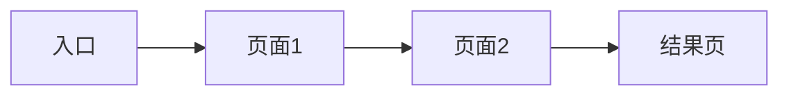

# 交互原型：{项目名称}

## 1. 页面清单

| 编号 | 页面名称 | 对应PRD功能 | 优先级 | 状态 |
|------|----------|-------------|--------|------|
| P1 | | | P0 | |
| P2 | | | P0 | |
| P3 | | | P1 | |

---

## 2. 用户流程

### 核心流程：{流程名称}



---

## 3. 页面线框图

### P1：{页面名称}

**页面用途**：

**页面布局**：

```
┌─────────────────────────────┐
│         顶部导航栏            │
├─────────────────────────────┤
│                             │
│         主要内容区            │
│                             │
│                             │
├─────────────────────────────┤
│         底部操作栏            │
└─────────────────────────────┘
```

**页面元素**：

| 元素 | 类型 | 交互行为 | 说明 |
|------|------|----------|------|
| | | | |

**交互说明**：

1. 
2. 

---

### P2：{页面名称}

**页面用途**：

**页面布局**：

```
┌─────────────────────────────┐
│                             │
│                             │
└─────────────────────────────┘
```

**页面元素**：

| 元素 | 类型 | 交互行为 | 说明 |
|------|------|----------|------|
| | | | |

---

## 4. 状态与反馈

| 状态 | 表现形式 | 说明 |
|------|----------|------|
| 加载中 | | |
| 空状态 | | |
| 错误状态 | | |
| 成功反馈 | | |

---

## 5. 动效规范

| 场景 | 动效 | 时长 | 缓动函数 |
|------|------|------|----------|
| 页面切换 | | | |
| 列表加载 | | | |
| 按钮点击 | | | |

---

> [!note] 下一步
> 本文档需要在步骤9的集体评审中校验。
