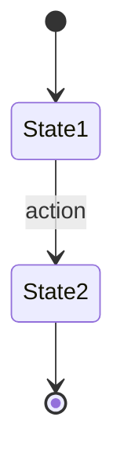

# 前端技术方案：{项目名称}

## 1. 技术选型

| 维度 | 选择 | 说明 |
|------|------|------|
| 前端框架 | | |
| 语言 | | |
| 构建工具 | | |
| 包管理器 | | |
| CSS 方案 | | |
| 状态管理 | | |
| 路由方案 | | |
| HTTP 客户端 | | |
| 测试框架 | | |
| 代码规范 | | |

---

## 2. 项目目录结构

```
src/
├── assets/            ← 静态资源
├── components/        ← 通用组件
│   ├── common/        ← 基础组件
│   └── business/      ← 业务组件
├── pages/             ← 页面组件
├── layouts/           ← 布局组件
├── router/            ← 路由配置
├── store/             ← 状态管理
├── services/          ← API 调用
├── hooks/             ← 自定义 Hooks
├── utils/             ← 工具函数
├── types/             ← 类型定义
└── styles/            ← 全局样式
```

---

## 3. 页面路由规划

| 路由路径 | 页面名称 | 说明 | 对应PRD功能 |
|----------|----------|------|-------------|
| / | | | |
| /login | | | |
| | | | |

---

## 4. 状态管理设计

### 全局状态

| 状态模块 | 包含数据 | 说明 |
|----------|----------|------|
| | | |

### 状态流转图



---

## 5. 组件层级设计

| 层级 | 类型 | 示例 | 说明 |
|------|------|------|------|
| L1 | 基础组件 | Button, Input, Modal | 无业务逻辑，纯 UI |
| L2 | 业务组件 | TaskCard, PriorityTag | 包含业务逻辑 |
| L3 | 页面组件 | HomePage, TaskPage | 页面级，组合 L1+L2 |
| L4 | 布局组件 | MainLayout, AuthLayout | 页面框架 |

---

## 6. API 对接规范

| 项目 | 规范 |
|------|------|
| Base URL | |
| 请求拦截 | |
| 响应拦截 | |
| 错误处理 | |
| Loading 状态 | |

---

## 7. 编码规范

| 项目 | 规范 |
|------|------|
| 命名规范 | |
| 文件组织 | |
| 注释规范 | |
| Git 提交规范 | |

---

> [!note] 下一步
> 本文档需要在步骤10中与 **👔 老板** 和其他架构师一起评审。
