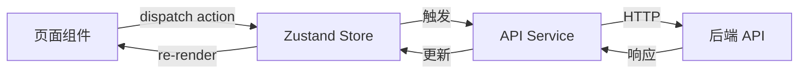

# 前端技术方案：智能待办应用（SmartTodo）

## 1. 技术选型

| 维度 | 选择 | 说明 |
|------|------|------|
| 前端框架 | React Native 0.73+ | 跨平台移动端开发 |
| 语言 | TypeScript 5.x | 类型安全 |
| 构建工具 | Metro Bundler | React Native 默认 |
| 包管理器 | pnpm | 快速、节省磁盘 |
| CSS 方案 | StyleSheet + Nativewind | RN 原生 + Tailwind 语法 |
| 状态管理 | Zustand | 轻量、简单、TS 友好 |
| 路由方案 | React Navigation v7 | RN 社区标准 |
| HTTP 客户端 | Axios | 拦截器生态成熟 |
| 测试框架 | Jest + React Native Testing Library | 单元 + 组件测试 |
| 代码规范 | ESLint + Prettier | 统一代码风格 |

---

## 2. 项目目录结构

```
src/
├── assets/               ← 图标、字体、图片
├── components/
│   ├── common/           ← Button, Input, Modal, Badge
│   └── business/         ← TaskCard, PriorityBadge, AIReasonLabel
├── pages/
│   ├── Auth/             ← LoginPage, RegisterPage
│   ├── Home/             ← HomePage (今日推荐)
│   ├── Tasks/            ← TaskListPage, TaskDetailPage, TaskCreatePage
│   └── Settings/         ← SettingsPage, ProfilePage
├── layouts/
│   └── MainTabLayout.tsx ← 底部 Tab 导航框架
├── navigation/
│   ├── AppNavigator.tsx  ← 主导航配置
│   └── AuthNavigator.tsx ← 登录流程导航
├── store/
│   ├── useAuthStore.ts
│   ├── useTaskStore.ts
│   └── useSettingsStore.ts
├── services/
│   ├── api.ts            ← Axios 实例和拦截器
│   ├── authApi.ts
│   └── taskApi.ts
├── hooks/
│   ├── useAuth.ts
│   └── useTask.ts
├── utils/
│   ├── date.ts
│   └── format.ts
├── types/
│   ├── task.ts
│   └── user.ts
└── styles/
    ├── theme.ts          ← 主题色、间距、字体
    └── global.ts
```

---

## 3. 页面路由规划

| 路由路径 | 页面名称 | 说明 | 对应PRD功能 |
|----------|----------|------|-------------|
| Auth/Login | 登录页 | 邮箱+密码登录 | 基础能力 |
| Auth/Register | 注册页 | 新用户注册 | 基础能力 |
| Home | 首页（今日推荐） | AI 推荐的今日任务清单 | FR-003 |
| Tasks/List | 任务列表 | 所有任务列表，支持筛选排序 | FR-002 |
| Tasks/Create | 创建任务 | 自然语言输入创建 | FR-001 |
| Tasks/Detail | 任务详情 | 查看/编辑任务详情 | 基础能力 |
| Settings | 设置页 | 通知偏好、账号管理 | 基础能力 |

---

## 4. 状态管理设计

### 全局状态

| 状态模块 | 包含数据 | 说明 |
|----------|----------|------|
| useAuthStore | user, token, isLoggedIn | 用户认证状态 |
| useTaskStore | tasks, todayTasks, loading | 任务数据和加载状态 |
| useSettingsStore | theme, notifications, timezone | 用户偏好设置 |

### 数据流转



---

## 5. 组件层级设计

| 层级 | 类型 | 示例 | 说明 |
|------|------|------|------|
| L1 | 基础组件 | Button, TextInput, Card, Badge, Icon | 无业务逻辑，纯 UI |
| L2 | 业务组件 | TaskCard, PriorityBadge, AIReasonLabel, EmptyState | 包含任务相关业务逻辑 |
| L3 | 页面组件 | HomePage, TaskListPage, TaskCreatePage | 页面级，组合 L1+L2 |
| L4 | 布局组件 | MainTabLayout, AuthLayout | 导航和页面框架 |

---

## 6. API 对接规范

| 项目 | 规范 |
|------|------|
| Base URL | 通过环境变量配置 `API_BASE_URL` |
| 请求拦截 | 自动注入 Authorization header（JWT） |
| 响应拦截 | 统一错误处理，401 自动跳转登录 |
| 错误处理 | Toast 提示 + 错误日志上报 Sentry |
| Loading 状态 | Zustand 中维护 loading flag |

---

## 7. 编码规范

| 项目 | 规范 |
|------|------|
| 命名规范 | 组件 PascalCase，函数/变量 camelCase，常量 UPPER_SNAKE |
| 文件组织 | 每个组件/页面独立目录，含 index.tsx + styles.ts |
| 注释规范 | 组件头部 JSDoc，复杂逻辑行内注释 |
| Git 提交规范 | Conventional Commits: `feat:`, `fix:`, `refactor:` |

---

> [!note] 下一步
> ✅ 已完成前端技术方案。需在步骤10中与 **👔 老板** 和其他架构师一起评审。
