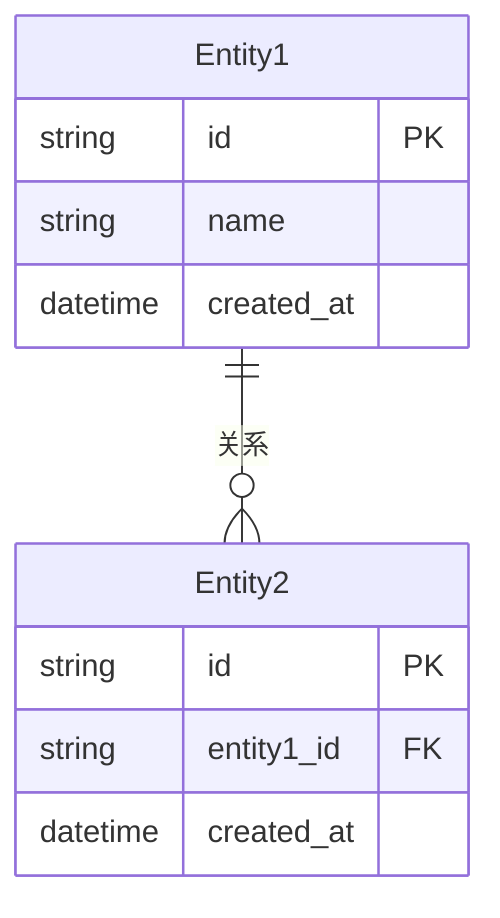

# 后端技术方案：{项目名称}

## 1. 技术选型

| 维度 | 选择 | 说明 |
|------|------|------|
| 编程语言 | | |
| Web 框架 | | |
| ORM | | |
| 数据库 | | |
| 缓存 | | |
| 消息队列 | | |
| 认证方案 | | |
| 日志框架 | | |
| 测试框架 | | |
| 部署方式 | | |

---

## 2. 项目目录结构

```
src/
├── config/            ← 配置文件
├── controllers/       ← 控制器层
├── services/          ← 业务逻辑层
├── models/            ← 数据模型
├── repositories/      ← 数据访问层
├── middleware/         ← 中间件
├── routes/            ← 路由定义
├── utils/             ← 工具函数
├── types/             ← 类型定义
├── validators/        ← 参数校验
└── tests/             ← 测试文件
```

---

## 3. 数据模型设计

### ER 图



### 表结构定义

#### 表名：{table_name}

| 字段名 | 类型 | 约束 | 说明 |
|--------|------|------|------|
| id | UUID | PK | 主键 |
| | | | |
| created_at | TIMESTAMP | NOT NULL | 创建时间 |
| updated_at | TIMESTAMP | NOT NULL | 更新时间 |

---

## 4. 服务层设计

| 服务名称 | 职责 | 依赖 | 对应PRD功能 |
|----------|------|------|-------------|
| | | | |
| | | | |

---

## 5. 认证与授权

| 项目 | 方案 |
|------|------|
| 认证方式 | JWT / OAuth2 / ... |
| Token 存储 | |
| 刷新机制 | |
| 权限模型 | RBAC / ABAC / ... |

---

## 6. 错误处理规范

### 错误码定义

| 错误码 | HTTP 状态码 | 说明 |
|--------|------------|------|
| SUCCESS | 200 | 成功 |
| BAD_REQUEST | 400 | 请求参数错误 |
| UNAUTHORIZED | 401 | 未认证 |
| FORBIDDEN | 403 | 无权限 |
| NOT_FOUND | 404 | 资源不存在 |
| INTERNAL_ERROR | 500 | 服务器内部错误 |

### 错误响应格式

```json
{
  "code": "ERROR_CODE",
  "message": "人类可读的错误信息",
  "details": {}
}
```

---

## 7. 编码规范

| 项目 | 规范 |
|------|------|
| 命名规范 | |
| 分层规范 | Controller → Service → Repository |
| 日志规范 | |
| 测试规范 | |
| Git 提交规范 | |

---

> [!note] 下一步
> 本文档需要在步骤10中与 **👔 老板** 和其他架构师一起评审。
> 同时需要配合 [[05-技术架构/后端方案/_模板-API文档|API 文档]] 一并输出。
