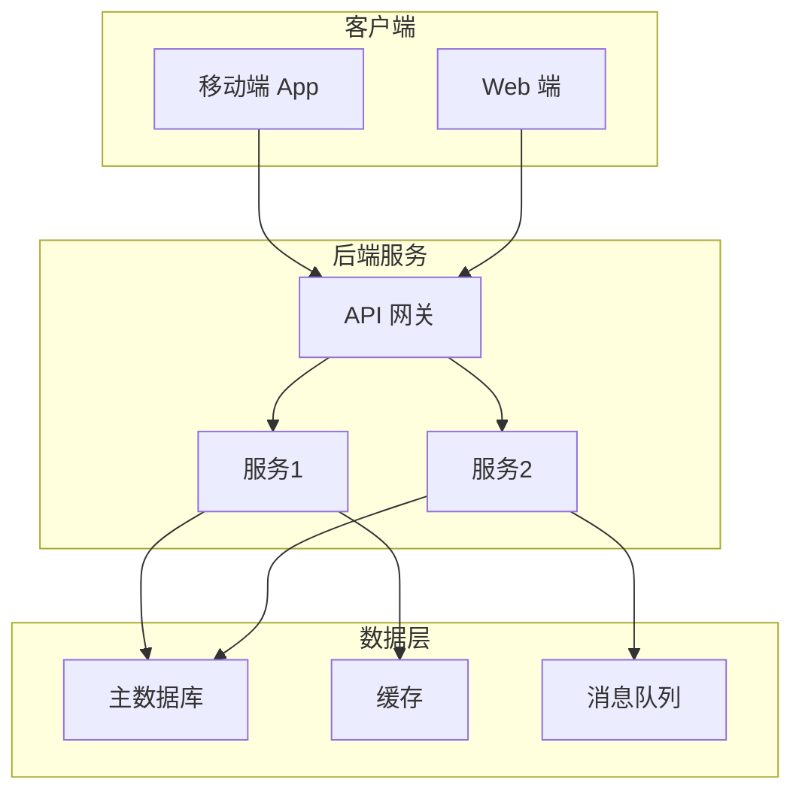
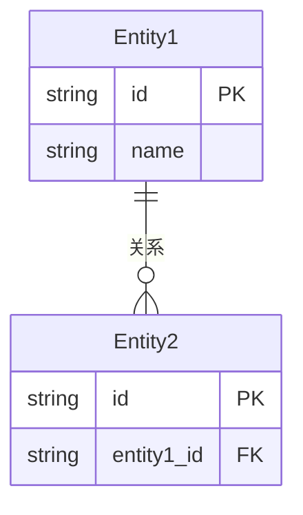

# 技术架构：{项目名称}

## 1. 架构概述

> 一句话描述系统的整体技术方向。

---

## 2. 技术选型

| 维度 | 选择 | 选择理由 | 备选方案 |
|------|------|----------|----------|
| 编程语言（后端） | | | |
| 后端框架 | | | |
| 编程语言（前端） | | | |
| 前端框架 | | | |
| 数据库（主库） | | | |
| 数据库（缓存） | | | |
| 云服务 / 部署 | | | |
| CI/CD | | | |
| 监控 / 日志 | | | |

---

## 3. 系统架构图

> 请根据实际架构修改上图。

---

## 4. 服务划分

| 服务名称 | 职责 | 核心功能 | 对应PRD功能 |
|----------|------|----------|-------------|
| | | | |
| | | | |

---

## 5. 数据库设计（ER 概要）

> 请根据实际数据模型修改上图。

---

## 6. 通信与接口规范

| 项目 | 规范 |
|------|------|
| API 风格 | RESTful / GraphQL |
| 数据格式 | JSON |
| 认证方式 | |
| 版本管理 | |
| 错误码规范 | |

---

## 7. 技术风险与约束

| 风险/约束 | 描述 | 影响程度 | 应对方案 |
|-----------|------|----------|----------|
| | | 高/中/低 | |
| | | 高/中/低 | |

---

## 8. 基础设施需求

| 环境 | 配置 | 说明 |
|------|------|------|
| 开发环境 | | |
| 测试环境 | | |
| 生产环境 | | |

---

> [!note] 下一步
> 本文档完成后，**🖥️ 前端架构师** 和 **⚙️ 后端架构师** 将基于此文档并行开展前后端技术方案设计。
