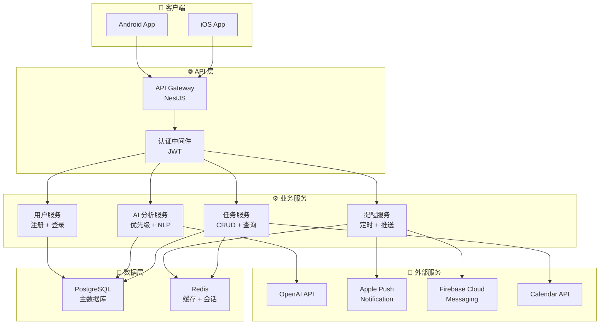
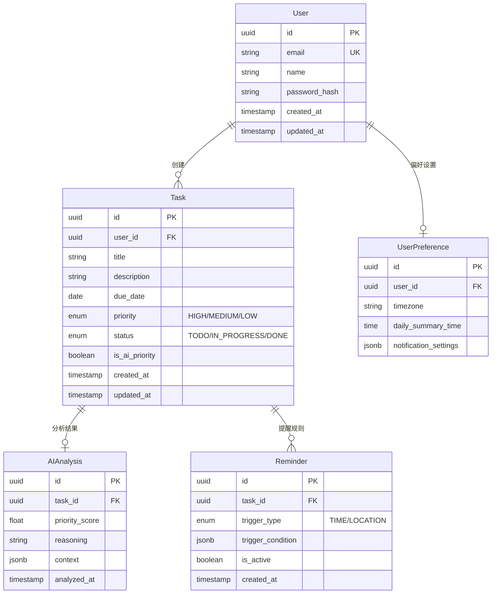

# 技术架构：智能待办应用（SmartTodo）

## 1. 架构概述

> 基于云端的移动优先应用，采用前后端分离架构，后端提供 RESTful API，前端使用 React Native 实现跨平台移动端，AI 能力通过第三方 API 接入。

---

## 2. 技术选型

| 维度 | 选择 | 选择理由 | 备选方案 |
|------|------|----------|----------|
| 编程语言（后端） | TypeScript (Node.js) | 前后端统一语言，降低切换成本 | Python, Go |
| 后端框架 | NestJS | 模块化架构，内置依赖注入，适合中大型项目 | Express, Fastify |
| 编程语言（前端） | TypeScript | 类型安全，IDE 支持好 | JavaScript |
| 前端框架 | React Native | 跨平台（iOS + Android），复用代码 | Flutter, Swift |
| 数据库（主库） | PostgreSQL | 成熟稳定，JSON 支持好，适合结构化数据 | MySQL |
| 数据库（缓存） | Redis | 高性能缓存，支持发布/订阅 | Memcached |
| AI 服务 | OpenAI API | MVP 阶段快速集成，后续可替换 | Claude API, 自研模型 |
| 云服务 | AWS (ECS + RDS) | 生态成熟，全球可用 | GCP, Vercel |
| CI/CD | GitHub Actions | 与代码仓库集成，免费额度充足 | GitLab CI |
| 监控 / 日志 | Sentry + CloudWatch | 错误追踪 + 基础设施监控 | Datadog |

---

## 3. 系统架构图

---

## 4. 服务划分

| 服务名称 | 职责 | 核心功能 | 对应PRD功能 |
|----------|------|----------|-------------|
| UserSvc | 用户管理 | 注册、登录、Token 管理、个人设置 | 基础能力 |
| TaskSvc | 任务管理 | 任务 CRUD、列表查询、今日推荐 | FR-001, FR-003 |
| AISvc | AI 分析 | 自然语言解析、优先级分析、推荐理由生成 | FR-001, FR-002, FR-003 |
| NotifySvc | 提醒管理 | 定时提醒、推送通知、日历同步 | FR-004, FR-005 |

---

## 5. 数据库设计（ER 概要）

---

## 6. 通信与接口规范

| 项目 | 规范 |
|------|------|
| API 风格 | RESTful |
| 数据格式 | JSON |
| 认证方式 | JWT (Access Token + Refresh Token) |
| 版本管理 | URL 路径版本 `/api/v1/` |
| 错误码规范 | 业务错误码 + HTTP 状态码 |

---

## 7. 技术风险与约束

| 风险/约束 | 描述 | 影响程度 | 应对方案 |
|-----------|------|----------|----------|
| AI API 延迟 | OpenAI API 响应时间不稳定(1-10s) | 高 | 异步分析 + 缓存结果 + 降级策略 |
| 推送可靠性 | APNs/FCM 推送可能丢失 | 中 | 推送日志追踪 + App 内补偿 |
| 数据安全 | 用户任务数据涉及隐私 | 高 | 传输加密(TLS) + 存储加密(AES-256) |
| 冷启动 | 新用户无历史数据，AI 推荐不精准 | 中 | 通用规则兜底 + 引导用户设置偏好 |

---

## 8. 基础设施需求

| 环境 | 配置 | 说明 |
|------|------|------|
| 开发环境 | 本地 Docker Compose | PostgreSQL + Redis + Node.js |
| 测试环境 | AWS ECS (1台) + RDS (db.t3.micro) | 共享测试实例 |
| 生产环境 | AWS ECS (2台) + RDS (db.t3.small) + ElastiCache | 初期配置，按需扩容 |

---

> [!note] 下一步
> ✅ 已完成整体架构设计。**🖥️ 前端架构师** 和 **⚙️ 后端架构师** 将基于此文档并行开展技术方案设计。
